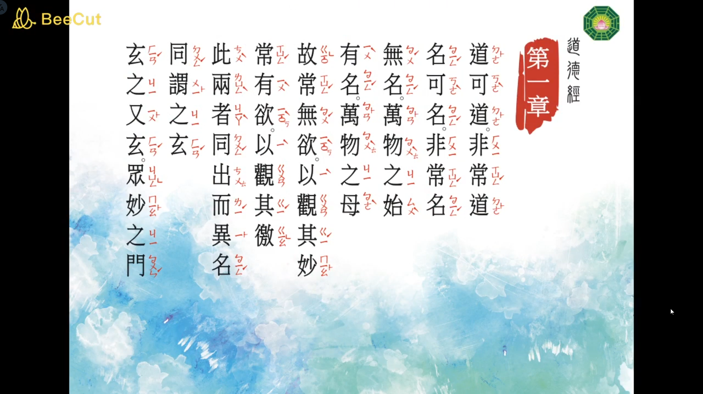
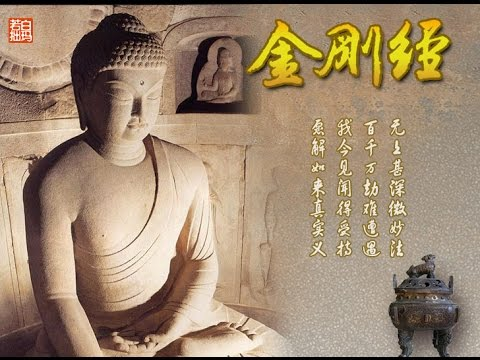

# 專案摘要 

值此末世，人心不古，群魔亂舞！

心念總在翻攪，難以止息，故人不得安寧。

欲要以台灣自上古輾轉流傳下來之古漢語誦念經文，一來
自身漢學基底不足；二來世面、網路可得文源，幾至全無。

罷矣！罷矣！既然沒有，亦不能久待，不如就捲臂親為？！
於是乎......本專案因而啟動。

## 【預計目標】

- 道德經（帛書版）
- 金剛經
- 六祖檀經

## 道德經

點擊下方圖片觀看 YouTube 播放清單：

<a href="https://www.youtube.com/playlist?list=PLfxLNQ7ERV68qytbqwoAMD0j1Q-d8BNTL">
  
</a>

## 金剛經（台語唸誦）

點擊下方圖片觀看 YouTube 影片：

<a href="https://www.youtube.com/watch?v=msvYAVsgU2A">
  
</a>


## 參考

Markdown 文檔置放 YouTube 影片【語法】範例：

1. Markdown 置放語法

```sh
[](播放清單網址)
```

2. 取得影片縮圖網址

    - YouTube 影片

        ```sh
        https://img.youtube.com/vi/影片ID/0.jpg
        ```

    - GitHub 容器

        ```sh
        images/圖片名稱.png
        ```

3. 合成 Markdown 語法

**【使用 YouTube 網站圖片】**

[](https://www.youtube.com/watch?v=msvYAVsgU2A)


**【使用 GitHub 容器內存圖片】**

[](https://www.youtube.com/watch?v=msvYAVsgU2A)
